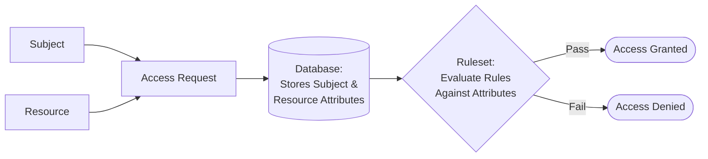

```mermaid
flowchart LR
    Subject[Subject]
    Resource[Resource]
    AccessRequest[Access Request]

    DB[(Database:
    Stores Subject &
    Resource Attributes)]
    RuleCheck{Ruleset:
    Evaluate Rules
    Against Attributes}

    AccessGranted([Access Granted])
    AccessDenied([Access Denied])

    Subject --> AccessRequest
    Resource --> AccessRequest
    AccessRequest --> DB

    DB --> RuleCheck

    RuleCheck -->|Pass| AccessGranted
    RuleCheck -->|Fail| AccessDenied

```